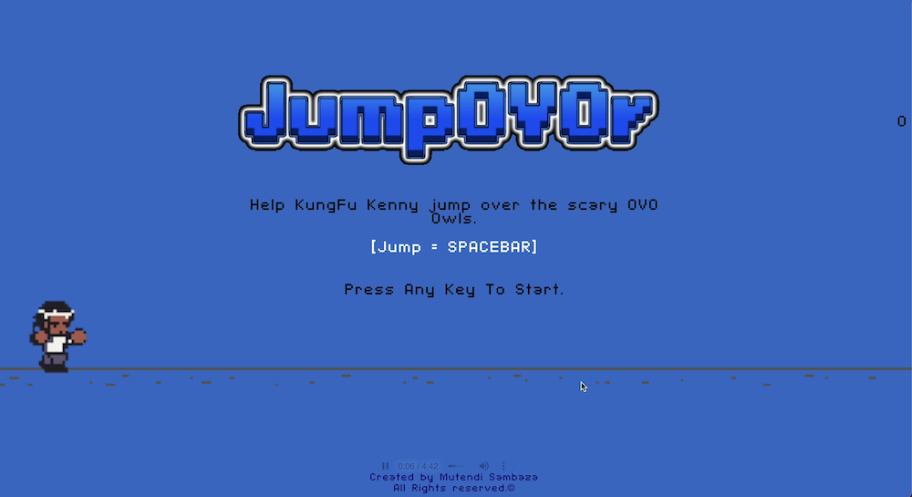

<!-- Improved compatibility of back to top link: See: https://github.com/othneildrew/Best-README-Template/pull/73 -->
<a id="readme-top"></a>
<!--
*** Thanks for checking out the Best-README-Template. If you have a suggestion
*** that would make this better, please fork the repo and create a pull request
*** or simply open an issue with the tag "enhancement".
*** Don't forget to give the project a star!
*** Thanks again! Now go create something AMAZING! :D
-->

<!-- PROJECT LOGO -->
<br />
<div align="center">
  <a href="https://github.com/mutendisambaza/JumpOVOr">
    
  </a>

<h3 align="center">JumpOVOr</h3>

  <p align="center">
    a spin on the No Internet Chrome Dino Game
    <br />
    <a href="https://github.com/mutendisambaza/JumpOVOr"><strong>Explore the docs »</strong></a>
    <br />
    <br />
    <a href="https://github.com/mutendisambaza/JumpOVOr/blob/main/gameplay.mov">View Demo</a>
  </p>
</div>


<!-- TABLE OF CONTENTS -->
<details>
  <summary>Table of Contents</summary>
  <ol>
    <li>
      <a href="#about-the-project">About The Project</a>
      <ul>
        <li><a href="#built-with">Built With</a></li>
      </ul>
    </li>
    <li>
      <a href="#getting-started">Getting Started</a>
      <ul>
        <li><a href="#installation">Installation</a></li>
      </ul>
    </li>
    <li><a href="#usage">Usage</a></li>
    <li><a href="#acknowledgments">Acknowledgments</a></li>
  </ol>
</details>


<!-- ABOUT THE PROJECT -->
## About The Project

A little project to test my skills and in web development, game development and UX Design. Thought I;d have some fun with it by basing it on the most talked about rap beef and two of my most listened to artists of our generation: Kendrick Lamar and Drake:

<p align="right">(<a href="#readme-top">back to top</a>)</p>


### Built With

* [![Javascript][javascript-shield]][javascript-url]
* [![CSS][CSS-shield]][CSS-url]
* [![HTML][HTML-shield]][HTML-url]

<p align="right">(<a href="#readme-top">back to top</a>)</p>


<!-- GETTING STARTED -->
## Getting Started

To run this locally do the following

### Installation

1. Clone the repo
   ```sh
   git clone https://github.com/mutendisambaza/JumpOVOr
   ```
2. Run the index.html file on your Chrome Browser

<p align="right">(<a href="#readme-top">back to top</a>)</p>


<!-- USAGE EXAMPLES -->
## Usage

<p align="center">SEE HOW FAR YOU CAN GO! </p>
    


<p align="right">(<a href="#readme-top">back to top</a>)</p>


<!-- ACKNOWLEDGMENTS -->
## Acknowledgments

* A special thanks to Kyle @ WebDevSimplified for the comprehensive tutorial that gave me the base code for this project

<p align="right">(<a href="#readme-top">back to top</a>)</p>


<!-- MARKDOWN LINKS & IMAGES -->
<!-- https://www.markdownguide.org/basic-syntax/#reference-style-links -->
[CSS-shield]: https://img.shields.io/badge/CSS-239120?&style=for-the-badge&logo=css3&logoColor=white
[CSS-url]: https://developer.mozilla.org/en-US/docs/Web/CSS
[javascript-shield]: https://img.shields.io/badge/JavaScript-F7DF1E?style=for-the-badge&logo=javascript&logoColor=black
[javascript-url]: https://www.javascript.com
[HTML-shield]: https://img.shields.io/badge/HTML5-E34F26?style=for-the-badge&logo=html5&logoColor=white
[HTML-url]: https://html.com


